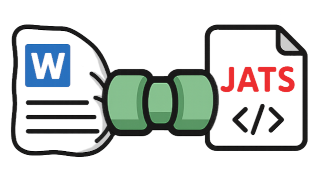
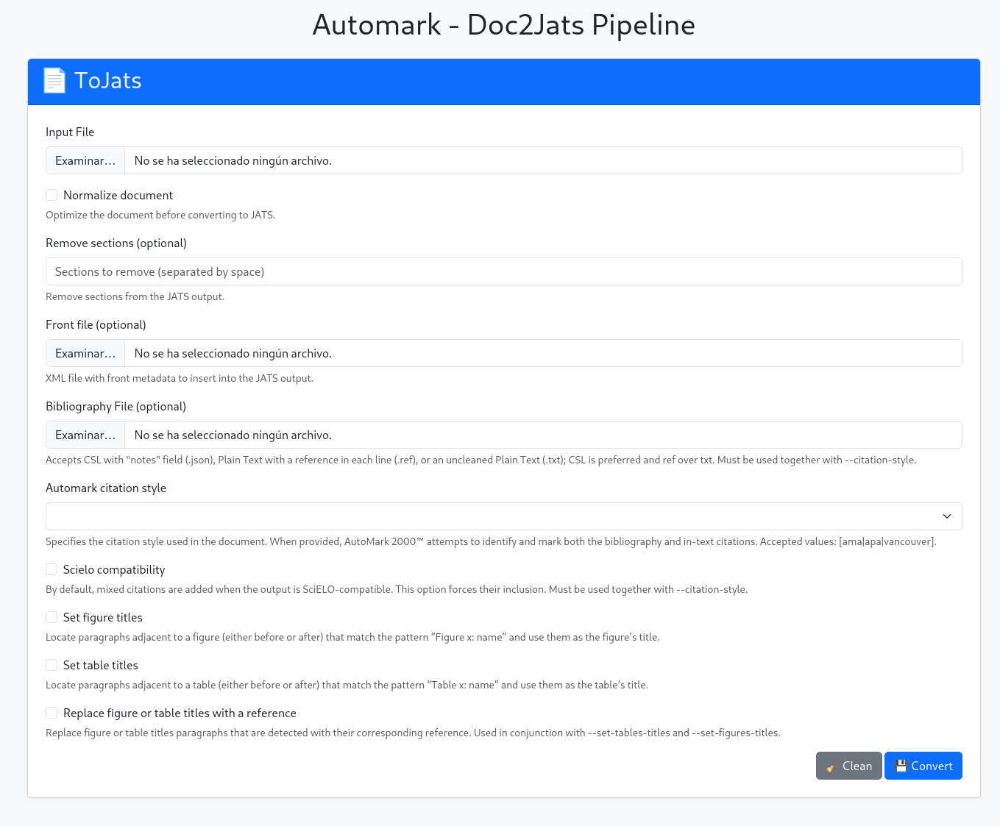

[](https://doi.org/10.5281/zenodo.18958457)

# AutoMark — doc2jats-pipeline

## Tool for converting DOC/DOCX documents to JATS XML with advanced automarking capabilities and other stuff.



---

This tool is built on top of a heavily modified version of **[\[Vitaliy-1 / docxToJats\]](https://github.com/Vitaliy-1/docxToJats)** and integrates several additional components to produce **JATS XML**.

It uses **[\[inukshuk / anystyle\]](https://github.com/inukshuk/anystyle)** to detect raw bibliography entries within the document and automatically generate the corresponding JATS `<ref-list>` section.

In addition to bibliography detection, the pipeline is capable of:

- **Automatically marking citations** according to the selected citation style (e.g., AMA, APA, Vancouver).

- **Identifying image and table titles**, even when they appear as plain text before or after the figure/table.
Generating normalized captions for figures and tables.

- **Create references to the images an tables** previously detected.

- **Merging the front metadata** with the converted JATS output.

- **Applying SciELO-compatible mappings and lookup**, customizable to some extend.

Overall, the pipeline combines document analysis, text extraction, structural detection, and metadata integration to produce a  **JATS XML** representation of the input document.

**What doesn't this tool do?**
✨ **Magic!** ✨ — especially when the document is poorly structured or written.

The tools can be executed in two modes: command-line and online.
The command-line version can also run the conversions remotely on another machine.



---

## 🚀 Quick start

This is the easier and faster way to get the application running with CLI commands and online tools.

This mode lets you use local CLI commands while Docker provides the online services and all the dependecies.

1. Follow the [Docker installation](#-docker-installation) steps.

2. Configure local CLI commands to call the remote (Docker) services by adding to `.env.local`:

```bash
cat >> .env.local <<EOF
ANONIMIZER_URL=http://localhost:8000/doc/anonymizer
NORMALIZER_URL=http://localhost:8000/doc/normalizer
DOCTOJATS_URL=http://localhost:8000/doc/tojats
JATSPUBLISHER_URL=http://localhost:8000/doc/jatsPublisher
EOF
```

3. Now you can run the local CLI commands and the online tools are in the port **8000**.

## 🛠️ Other installation methods

### 🖥️ Local installation

#### Prerequisites / System Requirements
- PHP 7.4 or higher
- Composer
- A modern Linux distribution (Debian/Ubuntu recommended)
- At least 4 GB RAM
- Disk space: 2–4 GB depending on fonts and external tools
- External tools and packages:
[LibreOffice](https://www.libreoffice.org/), pandoc, exiftool, [AnyStyle](https://github.com/inukshuk/anystyle/blob/main/README.md), etc.
You may check the [Dockerfile](docker/Dockerfile.7.4-apache-bullseye) for reference.
- Recommended: Install **all available system fonts** to avoid formatting issues.
- Optional since it is **WIP**:
    - Java (required by XMLCalabash)
    - [XMLCalabash](https://codeberg.org/xmlcalabash/xmlcalabash3/src/branch/main/README.org)
    - NodeJS (required by Vivliostyle CLI)
    - [Vivliostyle CLI](https://github.com/vivliostyle/vivliostyle-cli/blob/main/README.md)

#### Steps
1. Clone or download this repository. For example into `/opt/docxtojats-pipeline`.

2. Change to the application directory:
```bash
cd /opt/docxtojats-pipeline
```

3. If running in production, create a `.env.local` file:
```bash
echo APP_ENV=prod > .env.local
```

4. Install project dependencies:
```bash
composer install
```

5. After installation you will have all CLI commands available.

7. To enable online tools, configure your web server to use:
`/opt/docxtojats-pipeline/public`
as its document root. Since this is a Symfony app, configure it accordingly.

### 🐳 Docker installation

> **NOTE:** the [`docker-compose.yaml`](docker-compose.yaml) file currently uses the project’s root directory as a volume.

#### Prerequisites / System Requirements
- At least 4 GB RAM
- Disk space: ~5 GB
- Docker and Docker Compose

#### Steps

1. Clone or download this repository. For example into `/opt/docxtojats-pipeline`.

2. Change to the application directory:
```bash
cd /opt/docxtojats-pipeline
```

3. Adjust `docker-compose.yaml` to your needs (e.g., bind local data directories).
If running in production, set `APP_ENV` to `prod`.

4. Start the docker stack:
```bash
docker compose up -d
```

5. To access the container, identify the service name via `docker ps`, then:
```bash
docker exec -it docxtojats-pipeline-doc2jats-pipeline-1 bash
```

6. Online tools will be available on port **8000**.

---

## ⚙️ Configuration

### Application

This is a Symfony project, so you can configure it using `.env`, `.env.local`, `.env.prod.local`, etc.

It is recommended **not to modify `.env` directly**. Instead, use one of the `.local` variants, as they override the default settings.

The following environment variables can be modified to adjust the behavior of the application.
```bash
# Environment: dev, test, prodd
APP_ENV=dev

CONVERSION_TIMEOUT=60

# External tools binaries:
ANYSTYLE_BIN=/usr/local/bin/anystyle
EXIFTOOL_BIN=/usr/bin/exiftool
LIBREOFFICE_BIN=/usr/bin/libreoffice
LIBREOFFICE_HOME=/tmp/libreoffice
PANDOC_BIN=/usr/bin/pandoc

# Remote command execution:
#   ANONIMIZER_URL=https://mydomain.com/doc/anonymizer
#   NORMALIZER_URL=https://mydomain.com/doc/normalizer
#   DOCTOJATS_URL=https://mydomain.com/doc/tojats
#   JATSPUBLISHER_URL=https://mydomain.com/doc/jatsPublisher
ANONIMIZER_URL=http://localhost:8000/doc/anonymizer
NORMALIZER_URL=http://localhost:8000/doc/normalizer
DOCTOJATS_URL=http://localhost:8000/doc/tojats
JATSPUBLISHER_URL=http://localhost:8000/doc/jatsPublisher
```
---

### Image and Table Titles Detection

Keywords used to detect titles are stored in `config/automark/keywords/`. The application will automatically load all YAML files in this directory.

You can edit, delete, or add new languages and keywords as needed.

---

### Mappings

Mapping files are located in `config/automark/`. The application will automatically load all YAML files in this directory, so tecnically you can only have one flavour.

Currently, **Scielo mappings** are included only for certain keywords and tags.

> NOTE: At the moment these mappings are only used when AutoMark options are enabled.  
> The `docx2jats` tool has its own mappings, which currently match these ones.

---

## 💻 Commands

From the application directory you can list all commands with `bin/console list doc` and `bin/console list jats`.

```bash
Available commands for the "doc" namespace:
  doc:anonymizer    Converts the input file to PDF and strips its metadata
  doc:generate:csl  Generates the bibliography in CSL format from a file
  doc:normalizer    Clean and normalize documents
  doc:tojats        Converts a document to JATS XML

Available commands for the "jats" namespace:
  jats:publisher  Publish a jats document to html and pdf, this will create article.html, article.pdf and style.css files in the same folder as the input.
```
You can check each command arguments and options with `bin/console command_name --help`.

You can run the commands with `bin/console command_name --option1 --option2 argument1 argument2`.

When the CLI commands run remotely, they will call the same service endpoints using the URL configured in the corresponding environment variable.

---

### doc:tojats

| CMD | Service URL | Remote execution ENV | Description |
|-----|-------------|----------------------|-------------|
| `bin/console doc:tojats` | `/doc/tojats` | `DOCTOJATS_URL` | Converts a document to JATS XML. |

- Converts a document to JATS (this internally uses **docx2jats**).  
  `docx2jats` can detect and mark bibliographies for documents generated with **Zotero** or **Mendeley**.
```bash
bin/console doc:tojats my-document.docx output/
```

- Convert a document *after normalizing it first*.  
  `DOCX` files are notoriously inconsistent.
```bash
bin/console --normalize doc:tojats my-document.docx output/
```

- Convert a document *detecting titles for tables and figures*.  
  This searches for paragraphs matching patterns like “Figure 1: Something” before or after the image or table.  
  Keyword lists can be modified in the files under `config/automark/keywords`.
```bash
bin/console doc:tojats --set-figures-titles --set-tables-titles --replace-titles-with-references my-document.docx output/
```

- Convert a document *auto-detecting the bibliography* and *auto-marking citations*.  
  You must indicate the citation style.  
  If the document returned by **docx2jats** is *SciELO-compatible*, mixed citations will be added automatically.  
  You can force this behaviour with `--set-bibliography-mixed-citations`.
  This mode also outputs a `json` file containing the detected CSL entries with additional custom fields.  
  This file can be corrected and passed as `--bibliography-file`.
```bash
bin/console doc:tojats --citation-style apa my-document.docx output/
```

- Convert a document *auto-marking citations* using a bibliography provided via:
  - **CSL JSON** (`.json`): a CSL bibliography with custom fields.
      - `note`: to be used as `<mixed-citation>`.
      - `_citations`: array of literals to be replaced with the corresponding link to the reference.
  - **Ref list file** (`.ref`): one reference per line; parsed using **AnyStyle**.
  - **Plain text** (`.txt`): a block of text where **AnyStyle** will attempt to detect the bibliography.
```bash
bin/console doc:tojats --citation-style apa --bibliography-file my-bibliography.json my-document.docx output/
```

- A custom `XML` file containing `<front>` metadata may be provided to replace the existing `<front>` element.
```bash
bin/console doc:tojats --front my-front.xml my-document.docx output/
```

---

## doc:anonymizer

| CMD | Service URL | Remote execution ENV | Description |
|-----|-------------|----------------------|-------------|
| `bin/console doc:anonymizer` | `/doc/anonymizer` | `ANONIMIZER_URL` | Converts the input file to PDF and strips its metadata. |

This command is useful for **blind review workflows**. It converts a document to `PDF` and removes all embedded metadata.

---

## doc:normalizer

| CMD | Service URL | Remote execution ENV | Description |
|-----|-------------|----------------------|-------------|
| `bin/console doc:normalizer` | `/doc/normalizer` | `NORMALIZER_URL` | Clean and normalize documents. |

`DOCX` files are notoriously inconsistent.  
This tool uses **LibreOffice** to re-convert the file to `DOCX`, effectively cleaning and normalizing its internal structure to improve later parsing.

---

## jats:publisher (🚧 WIP)

| CMD | Service URL | Remote execution ENV | Description |
|-----|-------------|----------------------|-------------|
| `bin/console jats:publisher` | `/doc/jatsPublisher` | `JATSPUBLISHER_URL` | Publishes a JATS document to HTML and PDF, generating `article.html`, `article.pdf`, and `style.css` alongside the input file. |

This tool is currently **under development**, so it may be partially functional or not work at all.

It uses **XSLT** and **[Vivliostyle CLI](https://github.com/vivliostyle/vivliostyle-cli/blob/main/README.md)** to generate `HTML` and `PDF` output from a JATS/XML document.

At the moment it relies on the **[\[ncbi / JATSPreviewStylesheets\]](https://github.com/ncbi/JATSPreviewStylesheets)** project to convert JATS/XML into HTML.

The long-term goal is to make it **fully customizable** and support additional **eBook** output formats.

The CLI command accepts an `xml` file and writes all output files **in the same directory**.  
This is required because the generated HTML and PDF must reference the **original image paths**.

The command produces:

- `article.html`: the generated HTML version of the JATS document
- `article.pdf`: a PDF generated from the produced HTML
- `style.css`: the stylesheet used to render the HTML

The online tool instead accepts a single `ZIP` file, which **must** contain the JATS `xml` file **and all referenced images**.

---

### doc:generate:csl (🐞 Mostly for testing purposes)

| CMD | Service URL | Remote execution ENV | Description |
|-----|-------------|----------------------|-------------|
| `bin/console doc:generate:csl` | N/A | N/A | Generates the bibliography in CSL format from a file. |

This tool is for testing purposes, it preprocess the document and uses **AnyStyle** to generate a CSL.

---

## More technical documentation

- [Citations](doc/citations.md)
- [🇪🇸 Study on XSLT ➔ HTML ➔ PDF conversion](doc/estudio-conversion-pdf)

---

## 📌 TODO

- Unify bold and italic formatting across consecutive words into a single tag.

- Enhance figure/table title detection.
    - Improve separation between the actual title and the descriptive text.

- Improve handling of footnotes and endnotes.

- Clean up the XML even further.

- Improve document conversion and speed in **docx2jats**.

- Add support for BibTeX (.bib) files for the `-b|--bibliography-file` option.

- Create mixed citations when the `-b|--bibliography-file` option is a standar CSL file.

- Normalize option for images (add **ImageMagick** to the mix)
    - Reduce image sizes
    - Convert them to web-friendly formats (e.g., jpg, png, gif)
    - Perform cropping when it's detected in the document

- Detect and convert mathematical formulas in documents.
    - Identify inline and block-level math expressions.
    - Convert detected formulas to MathML or another JATS-compatible format.
    - Support fallback rendering (e.g., SVG or PNG) when MathML conversion is not possible.

- `App\Service\Automark\Dom\BibliographyGenerator` is functionally similar to `docx2jats/src/docx2jats/jats/Reference.php`.
    - The former is used in AutoMark for citations, while the latter is used when converting documents already marked with Zotero/Mendeley.
    - `docx2jats` should be able to use the lookup tables from `BibliographyGenerator`.
    - There should be a shared utility class or helper functions for both, to ensure consistency.
    - `BibliographyGenerator::createExtLink` should use a mapping file, (same goes for **docx2jats**).

- Language detection and internationalized support.
    - Automatically detect the document's primary language.
    - Adjust bibliographic parsing, typographic rules, and lookup tables accordingly.
    - Allow user-provided overrides when auto-detection is ambiguous or incorrect.

- Add an option to train **AnyStyle** when **AutoMark** is used and the CSL comes from the input options.
    - It should keep the referenced document and the CSL annotations for future incremental training.
    - Allow scheduled (cron) retraining using accumulated training samples.
    - Provide commands or endpoints to trigger incremental, full, or validated training.
    - Provide an option to export/import training samples.

- `RemoteConverterTrait`: should be merged into the abstract command once `JatsPublisherCommand` adapts to `AbstractBatchDocConverterCommand`.
    - It might even be enough to provide the output directory as a parameter to ensure compatibility.

- Add tests units and cases with different files.

- Improve logging and debugging.
    - Add a `--debug` option or detect `-vvv` so closures can throw exceptions instead of being caught silently for console-friendliness.
    - Create a custom Logger class that enriches context (e.g., command name, image used) and inject it everywhere instead of using `LoggerInterface` directly.

- Improve configuration for max file sizes and execution time limits.
    - Detect PHP configuration at runtime.
    - Enforce global command timeouts rather than fixed per-step limits.
    - Detect configuration errors (e.g., user-provided limits higher than PHP limits).
    - Validate the PHP configuration used in Docker.

- Add support for bearer keys or similar for remote commands.

- Clear all `E_USER_DEPRECATED` / `E_USER_NOTICE`.

- Uptdate to **PHP 8** and new **Symfony** version.

- Improve and update the Docker.

- **Conquer the world!** 🌍

<p style="background:white">
     
     
      
       
</p>
